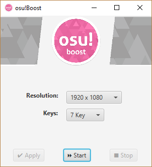

  

## What is Osu!Boost?
Osu!Boost is a bot that plays osu!mania songs perfectly or near-perfectly. It has support for 4 key songs, with reliable 5 and 7 key support coming soon.

## How does it work?
Osu!Boost plays like a human. Unlike other bots that analyze song files to produce perfect plays ahead of time, Osu!Boost looks at notes falling in real-time to determine what keys to press and when. 

Specifically, Osu!Boost uses a specially colored skin to distinguish between normal and sustained notes. All it really "sees" is 4, 5, or 7 pixels, depending on the play mode. This is all the information it needs to determine when to send keystrokes, handled by Java's Robot library.

## How to use Osu!Boost
1. Don't sign in or play ranked maps. You might get banned. Don't be evil.
2. Use the skin located in `skin/osu!Boost_skin.osk`
3. Modify your osu! settings to the following:
  
| Setting | Value |
| --- | ----------- |
| Frame Limiter | Unlimited |
| Fullscreen Mode | Off |
| Resolution | Borderless |
| Letterboxing | Off |
| Background video | Off |
| Combo bursts | Off |
| Parallax | Off |
| Background dim | Max |
| Scale with BPM | Off |
| (in-game) Scroll speed | 12 |

4. Navigate to the osu!mania song you'd like to play. Alt-tab to Osu!Boost.

5. Modify your Osu!Boost settings (resolution, keys) as needed. Hit apply.
6. Hit start, then alt-tab back to the game. Start the beatmap and watch the magic happen.
7. Hit stop when finished.

